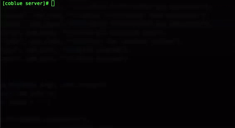

# coBlue - Control side
Program for interacting with **[coBlue](https://github.com/cocoahuke/coBlue)**. Provides C function interface for sending commands and file transfers, has been made into readline interactive command

[](https://travis-ci.org/cocoahuke/coblue-control)
[](https://github.com/cocoahuke/coblue-control/blob/master/LICENSE)

## Interactive command
```
coBlue console:
coget		coBlue filetransfer get operation
coread	coBlue filetransfer read operation
coput		coBlue filetransfer put operation
help		Show all availble cmds
clear		Clear the terminal screen
quit		Exit program
exit		Exit program
```

## Interface
```
int coblue_terminal(char *cmd);
int coblue_fileTransfer_get(char *remotepath,char* localpath);
int coblue_fileTransfer_read(char *remotepath);
int coblue_fileTransfer_put(char *localpath,char* remotepath);
void coblue_quit();
```
code of the interface is very short, Easy to modify it and customize to your project

## How to use

**Download**
```bash
git clone https://github.com/cocoahuke/coblue-control.git \
&& cd coblue-control
```

**Compile and install** to /usr/local/bin/

```bash
make
make install
```

**Play with [coBlue](https://github.com/cocoahuke/coBlue)**  

Make sure coBlue is running in the linux device and in the effective range  
Execute coblue-control and enter any command

After enter the first command will automatically start looking for device, and start establish connection

if need **Uninstall**
```bash
make uninstall
```

## Sample - M<font size=3>odify the wpa configuration file</font>




